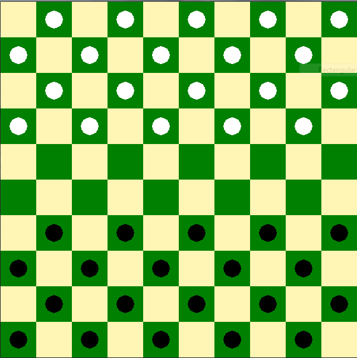

# CheckersLeague
A framework for supporting checkers tournaments for real and AI players

## Rules of the Game
A checker board is instantiated with a specific board size (any even number >=4) and time limit for each player to make a move. White and black pieces are arranged on opposing sides. Pieces are placed on alternating squares on their respective sides. The two middle rows of the board are left vacant. This means that for a board size of `n`, there will be `(1/2)(n * (n/2 - 1))` starting pieces for each player.

The game will begin with the movement of the white player, with each player alternating after that. For any player, if a valid move is not played within the time limit, a random valid move will be chosen for them.

### Piece Movement
An ordinary move of a man is to move forward left or right to an immediately neighboring vacant square. When the man reaches the farthest forward row, it is immediately promoted to a king. An ordinary move of a king is to move on any diagonal, forward or backward, to an immediately neighboring vacant square.

A capturing move of a man is to move forward left or right over a square occupied by an opponents piece to a vacant square immediately beyond it. The opponents piece is then removed from the board. If a capturing move creates an immediate further capturing move, the piece may continue capturing pieces. A capturing move of a king is similar to that of a man, except it can capture on any diagonal, forward or backward.

If a capturing move is available, the player must make a capturing move. If multiple capturing moves are available, the player can choose any capturing move available.

### Winning the Game
A player will win the game if it is the opposing players turn to move, and they have no valid moves available. The game will also end if there has not been a piece captured or promoted to king within the last 40 moves. In this case, the winner will be the player with the most pieces on the board. If both players have the same number of pieces, the game will end in a draw. 

## Creating a Bot
In order to create your own AI bot, you must implement the abstract class `AbstractPlayer` in the `players.interface` module. There are only three methods which you must implement:
* `__init__`: The constructor of your class must accept two parameters:
..* `board_size`: The number of squares wide each side of the board is.
..* `player_num`: A number indicating whether you are the first (white) player or second (black) player. This will always be 1 or 2.
* `get_name`: This method should return a string with your bot name used for display purposes.
* `move`: This method will be called when it is your players turn to make a move. It will be called with three parameters:
..* `board`: An instance of the `CheckerBoard` class defined in the `board` module which represents the current state of the game.
..* `time_limit`: The time, in seconds, you have to provide your move. If the call to this method does not return within `time_limit`, the caller will use the current value of `ret_val` as your move.
..* `ret_val`: An empty list for you to provide your move in. Your move should be represented as a list of tuples, eg, `[(start_row, start_col), (end_row, end_col)]`. Multiple jump moves should include all intermediate steps. Note, this list should be appended or extended with your move. This is necessary because this method will be called in a separate thread, so a value can not be returned directly to the caller.

Note that it is expected that your implementation will stop processing once the time limit is reached and will not spawn any other background threads, but this isn't enforced. Please be a good sport and don't steal your opponents processing time!

### SimpleAI: A Sample
The `SimpleAI` class in the `players.simple_ai` module implements a basic [minimax algorithm](https://en.wikipedia.org/wiki/Minimax) which you can use as a starting point for your program or as a baseline to compete against. There are improvements you can make to this implementation of the minimax algorithm which will make it more efficient, but you are also encouraged to explore completely different approaches to the problem!

### Testing your Program
The `board_gui` module can be used for testing your AI bot. This program will launch a gui which displays the game board as the game progresses. This program requires having the [pygame](http://pygame.org) package installed. You should edit the instantiation of the `CheckerBoardGUI` in the `main` method to use your class. The parameters for the constructor are:
* board size: The number of squares wide the board should be. This must be an even number >= 4
* time limit: The number of seconds each player will have to make a move
* white player: Class of the white player
* black player: Class of the black player

Note that the last two arguments should be the *class*, not an instance of the class.

Alternatively, if you do not wish to install the `pygame` package, you can also use a console based version defined in the `board` module. In the `main` method, edit the definition of the `players` array to include an instance of your class and the class you would like to compete against. 